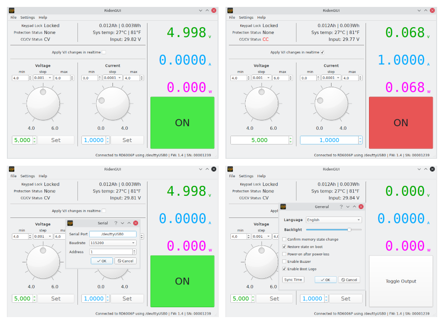

# RidenGUI
Riden Qt GUI using PySide2

#### Install
Install [Poetry](https://python-poetry.org) first (available via pip)
```
git clone https://github.com/ShayBox/RidenGUI.git
cd RidenGUI
poetry build
pip install --user dist/*.tar.gz
OR
pip install --user dist/*.whl
```

#### Usage
The `ridengui` command is used to start the GUI.  
A desktop entry and icon are available in the `data` directory.  
After very first execution, you will have to specify serial port, apply change and restart application.  
After that you could set GUI V/I limits and change steps. This is, for exampe, handy for safety if you work with low voltage electronics.  
These settings are not the same as OCP and OVP on device itself, they are just limits in this RidenGUI.  
All these settings are preserved between RidenGUI restarts.

#### Compatibility
Compatible with models RD6006, RD6006P, RD6012, RD6018.

#### Screenshots thumbnail. Full scale ones are in screenshots folder.
