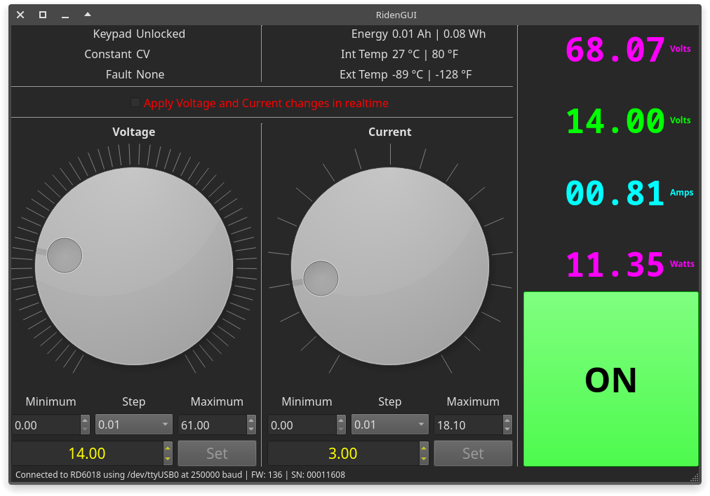
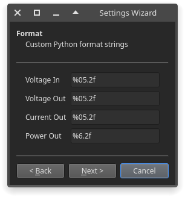

# RidenGUI

Qt 5/6 based GUI for Riden RDXX power supplies written in Python

#### Screenshots
  



#### Issues
Please report and discuss issues on [Discussions]

#### Installation
Requirements:
- [Python] 3.7 or later
- PySide2 (Qt5) or PySide6 (Qt6)
```
$ pip install --user pyside2
$ pip install --user git+https://github.com/shaybox/ridengui.git
```

Adding to an existing poetry project:
```
$ poetry add git+https://github.com/shaybox/ridengui.git
```

#### Usage
There's icon and desktop entry files in the `data` directory.  
Run the command `ridengui` to start the GUI.

[Discussions]: https://github.com/ShayBox/RidenGUI/discussions
[Python]: https://python.org