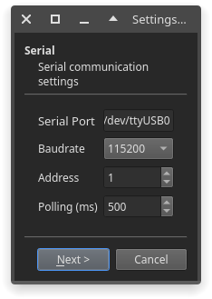
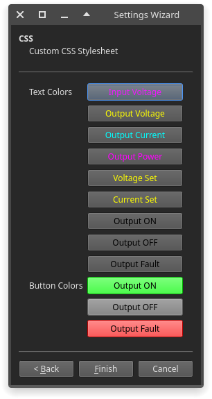

# RidenGUI

Qt 5/6 based GUI for Riden RDXX power supplies written in Python

#### Screenshots
  


  

#### Issues
Please report and discuss issues on [Discussions]

#### Installation
Requirements:
- [Python] 3.7 or later
- [Poetry] via pip
- [PyQt5] or [PyQt6]
```
$ pip install --user pyqt5
$ pip install --user git+https://github.com/shaybox/ridengui.git

$ ridengui
```

### Development
`poetry` is a required build dependency (build tool)
```
git clone https://github.com/ShayBox/RidenGUI.git
cd RidenGUI
poetry env use <python3 executable>

$ poetry run ridengui
```

#### Usage
There's icon and desktop entry files in the `data` directory.  
Run the command `ridengui` to start the GUI.  
Run the command `ridengui --help` to see the command line options.

[Discussions]: https://github.com/ShayBox/RidenGUI/discussions
[Python]: https://python.org
[Poetry]: https://python-poetry.org
[PyQt5]: https://pypi.org/project/PyQt5
[PyQt6]: https://pypi.org/project/PyQt6